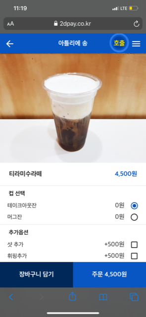
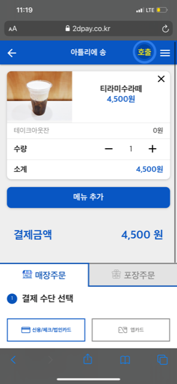
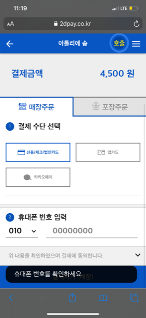

# 투디엠 서비스 화면

## QR 결제시스템 서비스
  - 매장에서 주문 할 시에 QR을 찍어 메뉴를 보고 주문 하는 시스템
<div>
  
  
  
 </div>
<div>
  
  
 </div>


### 진행한 프로젝트
```
1. QR 결제 서비스
2. 라이더 용 웹 서비스 ( 실시간 웹 푸시, 회사 가맹점 앱과 연동 )
3. 다국어 서비스
4. 사파리, 크롬 웹 한정 카드 스캔 결제 서비스
```

### 사용한 기술

```
front-end : vue js, lazy-load, pwa, socket io client
back-end : php ( codeigniter ), mysql ( aurora )
```
